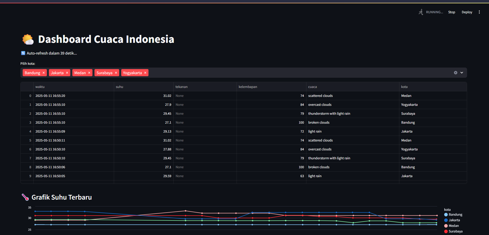

---

# 🌤️ Cuaca Dashboard

Aplikasi dashboard Streamlit untuk menampilkan data cuaca real-time dari beberapa kota di Indonesia menggunakan API OpenWeatherMap dan PostgreSQL sebagai penyimpanan data.

## 🚀 Fitur

- Ambil data cuaca (temperatur, kelembapan, kondisi langit) dari beberapa kota
- Simpan data secara berkala ke PostgreSQL
- Dashboard interaktif dengan filter kota & grafik tren suhu dan kelembapan
- Otomatisasi dengan cronjob
- Logging aktivitas dan error
- Keamanan API key melalui file `.env`

## 🧩 Teknologi

- Python
- Streamlit
- PostgreSQL
- OpenWeatherMap API
- Pandas, psycopg2, SQLAlchemy, dotenv

## 📸 Dashboard



## 📦 Struktur Folder

```
cuaca\_project/
├── dashboard/
│   └── app.py              # Aplikasi Streamlit
├── scripts/
│   └── fetch\_data.py       # Script pengambilan data cuaca
├── logs/
│   └── fetch.log           # Log pengambilan data
├── .env                    # File API key
├── requirements.txt
├── README.md
```

## ⚙️ Setup

### 1. Clone & install environment

```bash
git clone https://github.com/username/cuaca_project.git
cd cuaca_project
python3 -m venv env
source env/bin/activate
pip install -r requirements.txt
````

### 2. Buat file `.env`

```env
OPENWEATHER_API_KEY=your_api_key_here
```

### 3. Setup PostgreSQL

```sql
-- Masuk ke PostgreSQL shell:
sudo -u postgres psql

-- Jalankan:
CREATE USER cuaca_user WITH PASSWORD 'cuaca_pass';
CREATE DATABASE cuaca_db OWNER cuaca_user;
GRANT ALL PRIVILEGES ON DATABASE cuaca_db TO cuaca_user;
\q
```

> Gunakan PostgreSQL default authentication (tanpa ubah `pg_hba.conf` bila sudah bisa konek)

### 4. Tes ambil dan simpan data

```bash
python scripts/fetch_data.py
```

### 5. Jalankan dashboard

```bash
streamlit run dashboard/app.py
```

## 🔁 Otomatisasi dengan Cron

Edit crontab:

```bash
crontab -e
```

Tambahkan baris berikut (setiap 30 menit):

```bash
*/30 * * * * /home/username/projects/cuaca_project/env/bin/python /home/username/projects/cuaca_project/scripts/fetch_data.py >> /home/username/projects/cuaca_project/logs/cron.log 2>&1
```

## 🔐 Keamanan

* Pastikan `.env` masuk dalam `.gitignore`:

  ```
  .env
  logs/
  ```

* Jangan pernah upload `.env` ke GitHub

## 📑 Lisensi

MIT License – bebas digunakan, modifikasi, dan kontribusi.

---
